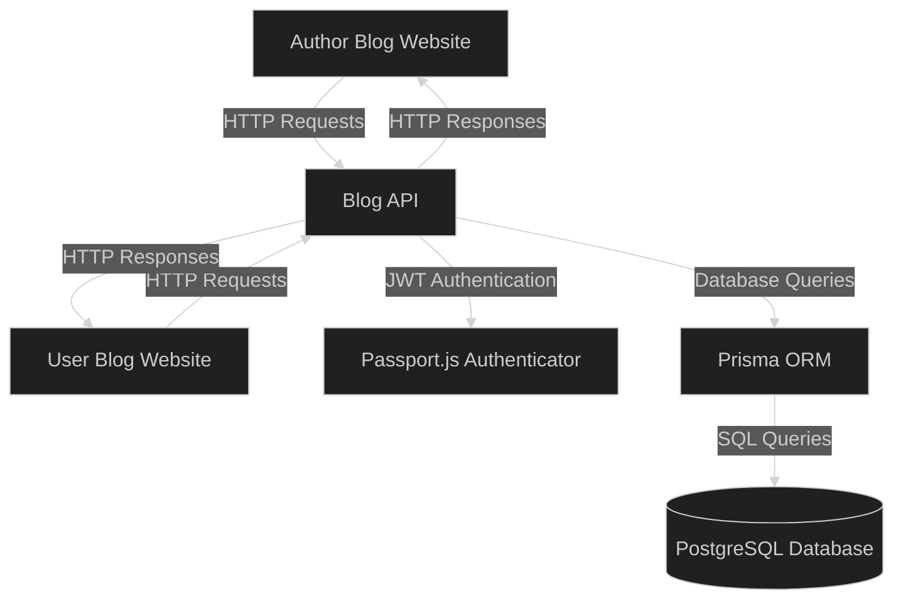

# Blog-API (Backend)


## Project Structure

```bash
.
├── app.ts
├── generated
├── LICENSE
├── package-lock.json
├── package.json
├── prisma
│   └── schema.prisma
├── prisma.config.ts
├── README.md
├── script.ts
├── src
│   ├── config
│   │   ├── jwtGenerator.ts
│   │   └── jwtStrategy.ts
│   ├── controllers
│   │   ├── Author
│   │   │   ├── CreateBlog.ts
│   │   │   ├── Dashboard.ts
│   │   │   ├── Login.ts
│   │   │   ├── Logout.ts
│   │   │   └── SignUp.ts
│   │   └── User
│   │       ├── CreateComment.ts
│   │       ├── Homepage.ts
│   │       ├── Login.ts
│   │       ├── Logout.ts
│   │       └── SignUp.ts
│   ├── lib
│   │   ├── prisma.ts
│   │   └── queries.ts
│   └── routes
│       ├── Author-Frontend.ts
│       └── User-Frontend.ts
└── tsconfig.json

```

---

## System Architecture



---

##  🛠️ Languages and Tools

### Backend: 
  

### Authentication:  
 

### Database: 
 

### Testing: 


---

## How to Run

1. Clone the repository
```bash
git clone
```

2. Install dependencies
```bash
npm install
```

3. Run Development Server
```bash
node app.ts
```

4. Open `http://localhost:8080` in your browser
